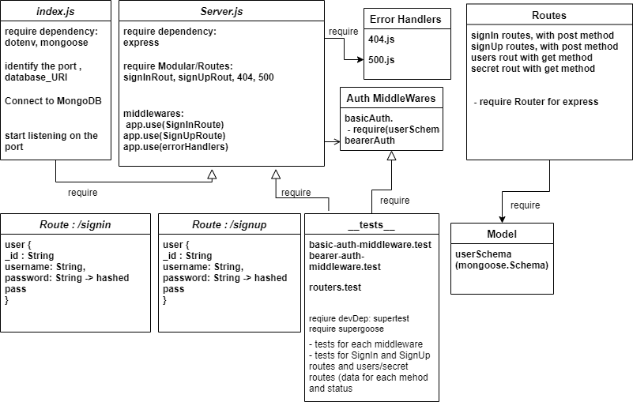

# bearer-auth-nihad

### Author: Nihad Zeidan

### tests report:

[Heroku](https://nihad-bearer-auth.herokuapp.com/)

[GitHub PR](https://github.com/NihadZeidan/bearer-auth-nihad/pull/1)

[GitHub Actions](https://github.com/NihadZeidan/bearer-auth-nihad/actions)

### .env requirements

PORT - Port Number

DataBase_URI=mongodb://localhost:27017/auth

### Running the app
`npm run start`

### Endpoints: 

post `/signin`

post `/signup`

get `/users`

get `/secret`

Returns Object

{

  user {

    "_id": "String",

    "username": "String",

    "password": "String",

  }
  
}

### Tests
Unit Tests: `npm test`

### UML

